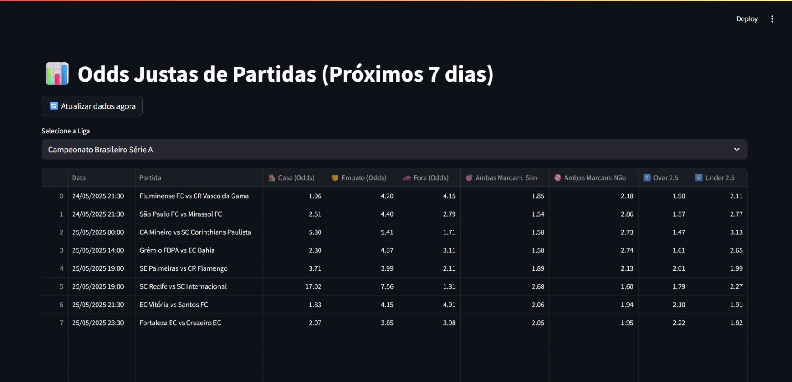
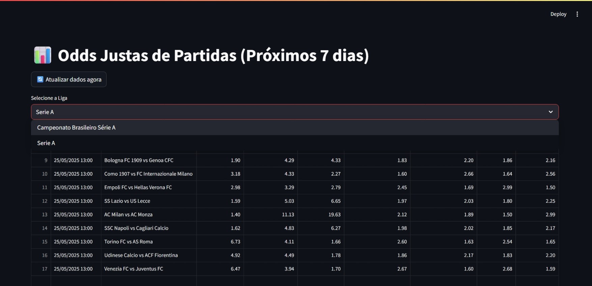
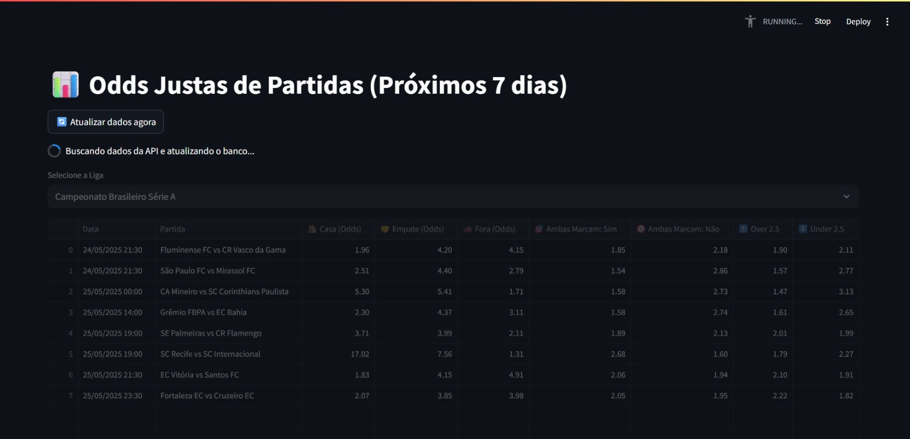
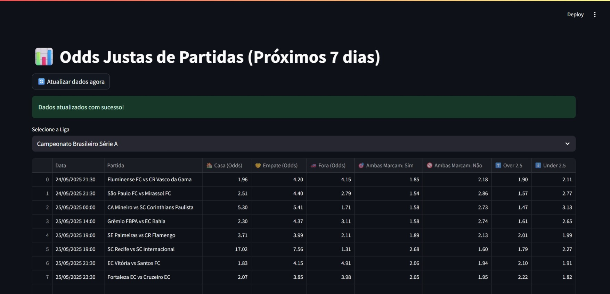

# ⚽️ Football Match Prediction App

Aplicação completa que consome dados da [Football-Data.org](https://www.football-data.org/), armazena em banco de dados e calcula odds justas para partidas futuras nos mercados:

* **1X2 (Resultado final)**
* **Ambas Marcam (BTTS)**
* **Over/Under 2.5 Gols**

Interface desenvolvida com **Streamlit**, processamentos com **Python + SQLAlchemy**, e persistência em **PostgreSQL**, rodando em **Docker**.

---

## 🚀 Como usar

### ✅ 1. Clone o repositório

```bash
git clone https://github.com/kevinmelo-dev/football-prediction.git
cd football-prediction
```

---

### ✅ 2. Configure as ligas e temporadas no `.env`

Crie ou edite o arquivo `.env`:

```ini
# Token da API
API_TOKEN=your_api_token

# Ligas desejadas
LEAGUES=BSA

# Temporadas desejadas
SEASONS=2023,2024,2025

# Configurações do banco de dados
DB_HOST=db
DB_PORT=5432
DB_NAME=football
DB_USER=postgres
DB_PASSWORD=postgres
```

> 🔐 **Não exponha sua API\_TOKEN em público.**

---

### ✅ 3. Suba os containers com Docker

```bash
docker compose up --build
```

Isso irá:

* Instalar dependências
* Criar o banco PostgreSQL
* Iniciar o servidor da interface (Streamlit)

A interface estará disponível em:
📍 [http://localhost:8501](http://localhost:8501)

> ⚠️ **Atenção:** Após iniciar os containers, o banco estará vazio.
> Para ver os dados, você deve rodar o fetch manualmente:
>
> * Usando o botão na interface: **🔄 Atualizar dados agora**
> * Ou pela linha de comando:
>
> ```bash
> docker compose exec app python main.py fetch
> ```

---

### ✅ 4. Busque e processe os dados

Você pode atualizar os dados manualmente de duas formas:

#### a) Pelo botão “🔄 Atualizar dados agora” na interface

Ou

#### b) Pela linha de comando:

```bash
docker compose exec app python main.py fetch
```

Isso irá:

* Buscar todas as partidas das ligas/temporadas configuradas
* Armazenar no PostgreSQL
* Calcular probabilidades com modelo estatístico

---

## 📊 Interface

A interface lista as partidas que ocorrerão nos **próximos 7 dias**, com:

* Odds justas calculadas com base em **modelo estatístico (Poisson)**
* Filtros por **liga**
* Atualização sob demanda
* Visualização direta por time e data

### 🖼️ Screenshots da Interface






---

## 📦 Estrutura do Projeto

```bash
src/
├── api/                   # Comunicação com football-data.org
├── core/                  # Fetcher principal (run_fetch)
├── db/                    # Conexão e engine SQLAlchemy
├── models/                # Models do banco (ORM)
├── predictor/             # Lógica de previsão com Poisson
├── ui/                    # Interface Streamlit
├── main.py                # Entrada principal para fetch manual
```

---

## ⚙️ Tecnologias

* Python 3.11
* Docker & Docker Compose
* Streamlit
* PostgreSQL 15
* SQLAlchemy
* Pandas, NumPy, SciPy

---

## 🔒 Segurança

* Tokens e configurações são lidas do `.env`
* Nunca versionar `.env` ou expor a `API_TOKEN`

---

## 🧠 Modelo Estatístico

* **Poisson** ponderado pelos últimos jogos para prever gols esperados
* Odds derivadas de matriz de placares possíveis
* Resultados realistas e explicáveis

---

## 📌 Códigos de Ligas da API

| Liga                | Código |
| ------------------- | ------ |
| Brasileirão Série A | `BSA`  |
| Premier League      | `PL`   |
| La Liga (Espanha)   | `PD`   |
| Bundesliga          | `BL1`  |
| Serie A (Itália)    | `SA`   |
| Ligue 1 (França)    | `FL1`  |

---

## 🧪 Testado com:

* `LEAGUES=BSA,SA,PL`
* `SEASONS=2023,2024,2025`

---

## 📄 Licença

MIT — use, modifique e distribua à vontade.
Créditos à [Football-Data.org](https://www.football-data.org/) pelo fornecimento dos dados.
